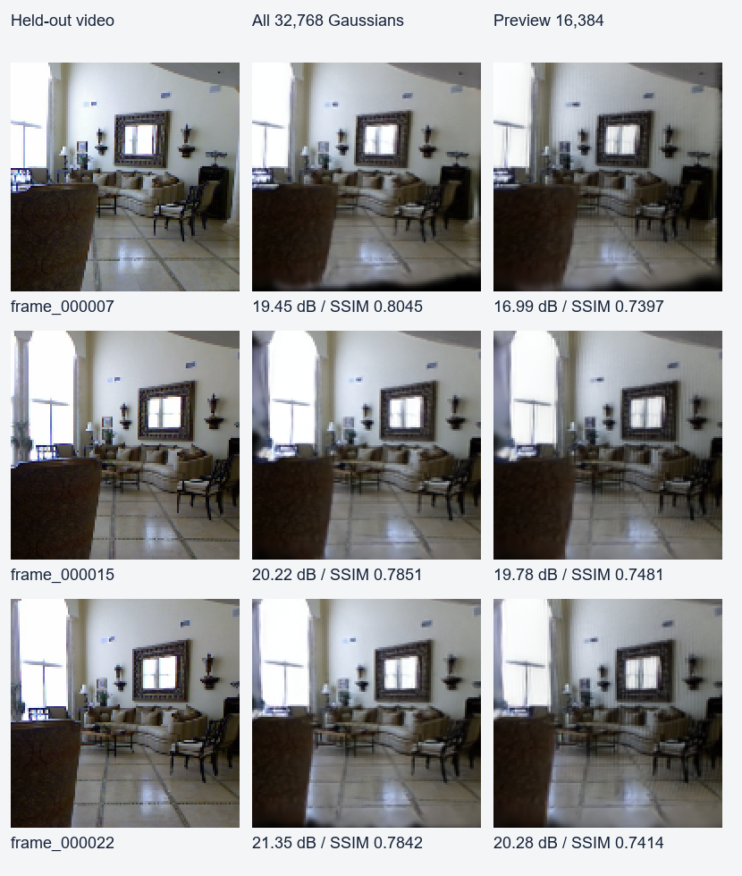

# 四路分组渲染资源优化与实板验收 — 2026-09-30

已完成 HLS、实际 DMA/CDC RTL、整板综合/布局布线、BOOT 分区核验、备份、
网络安装、软件重启和实板回归。板上当前为 `grouped-shared` 四路 200 MHz。
范围是**高斯场景已加载后，输入新相机到完整 RGB 帧返回**；不含视频准备、
图像落盘、遥控通信和显示器扫描。分辨率始终为 128×128。

## 同输入实板结果

ARM 原生程序 SHA-256 为 `5dace0ce6ffd7ece5b8389598a938270aec784660e9eeed056e305ef9e9408c7`。
CPU 程序、32768 点模型、三个视角、4 线程、batch=2、11 位基数排序、并行
Tile 分组均未改变。先测旧硬件 60 帧，再替换硬件测两组各 60 帧。

| 完整点集 | 帧数 | 平均 ms | 中位数 ms | P95 ms | P99 ms | 最大 ms |
|---|---:|---:|---:|---:|---:|---:|
| 本轮旧硬件 | 60 | 46.930 | 46.777 | 48.028 | 48.050 | 48.055 |
| 新硬件第一组 | 60 | 44.223 | 44.339 | 45.278 | 46.527 | 47.150 |
| 新硬件复测 | 60 | 43.348 | 43.300 | 44.292 | 46.181 | 46.449 |
| 新硬件两组合计 | 120 | **43.786** | **43.840** | **45.271** | **46.382** | **47.150** |

合计延迟减少 **6.70%**，串行换视角等效 **22.84 FPS**。两组单独改善
5.77% / 7.63%，不能把 CPU 调度及缓存波动全部归因于硬件。更稳定的硬件
计数由 5215402 降至 4762907 周期，减少 **8.68%**；两组周期分别为
4762923 / 4762892。历史 45.21 ms 与当前基线来自不同运行，不能拼作本轮对照。

| 阶段 | 旧硬件 ms | 新硬件 120 帧 ms |
|---|---:|---:|
| CPU 投影 | 7.975 | 7.775 |
| 收集、排序、Tile 列表 | 10.011 | 9.323 |
| FPGA 提交、执行、回读、结果整理 | 26.682 | **24.414** |
| RGB 封装 | 1.231 | 1.230 |

新分组阶段内部为收集 3.371、纯基数排序 2.461、Tile 散布 3.491 ms。
FPGA 阶段内统计上传 2.495、等待 12.939、回读 0.676 ms；它们不能再与
24.414 ms 相加，接口还存在批间重叠及其他工作。完整返回时间以 wall_ms
为准。逻辑输入约 3.29–3.44 MB/视角，像素输出 262144 字节，不是 DDR
实际流量测量。两组新程序峰值 RSS 39068/39472 KiB，功耗未测。

## 速度预览和质量代价

在新硬件另测既有 16384 点均匀预览，两轮各 30 帧；这是抽样配置，不能与
完整点集混称同精度优化。没有本轮旧硬件 16k 配对测量，因此不宣称其硬件
加速比例。新硬件两轮 27.683 / 26.991 ms，合计 **27.337 ms，36.58 FPS**，
中位数 27.291、P95 28.079、P99 28.176、最大 28.230 ms。

重新用板端原始浮点帧计算与留出视频 RGB 的画质，显示截断 [0,1]，SSIM
使用 11×11、sigma=1.5 Gaussian valid window。效果图为原 128×128 最近邻
放大，没有补帧、锐化或超分。

| 视角 | 完整点集 PSNR / SSIM | 16k 预览 PSNR / SSIM |
|---|---|---|
| 7 | 19.4519 dB / 0.8045 | 16.9908 dB / 0.7397 |
| 15 | 20.2223 dB / 0.7851 | 19.7815 dB / 0.7481 |
| 22 | 21.3486 dB / 0.7842 | 20.2816 dB / 0.7414 |

完整点集所有归档 raw/RGB 与旧硬件逐位一致，120 张计时帧分别匹配对应
归档图；这次硬件修改没有额外图像损失。原重建模糊/边缘空洞仍在，首视角
仍低于原 20 dB 指引。16k 首视角损失约 2.46 dB，不应标为画质无损。

## 实现及物理结果

同一高斯的至多四个子块合并进入像素流水，减少反复进入和排空流水的成本；
224 位紧凑参数记录放入分布式 RAM；内部 lane FIFO 显式压缩为 232 位；
不随像素变化的位置/conic/颜色/透明度在循环外读取复用。保留四路计算、
FP16 运算、前后深度顺序、外部 512 位 DMA ABI 和原时钟。

缩窄 FIFO 的 HLS 数量变化大，但 Vivado 本来就会剪除无用位，不能把 HLS
减少的 LUT 都算成实际节省。公共参数复用相对紧凑缓存的同阶段 post-opt
网表实际减少 1626 LUT、1560 FF。BRAM 队列实验多占 52 BRAM18，HLS 仅少
160 LUT 且多 952 FF，本轮未选用。各独立实验详见 REVIEW.md。

| 布线后资源 | 旧 ROM 硬件 | 当前分组共享参数 |
|---|---:|---:|
| LUT | 60398 / 78600 (76.84%) | 61260 / 78600 (**77.94%**) |
| FF | 97523 / 157200 (62.04%) | 98377 / 157200 (**62.58%**) |
| Slice | 19484 / 19650 (99.16%) | 19618 / 19650 (**99.84%**) |
| BRAM36 等效 | 226.5 / 265 (85.47%) | 218.5 / 265 (**82.45%**) |
| DSP | 252 / 400 (63%) | 252 / 400 (**63%**) |

这是使原先放不下的分组计算能部署，不是让最终设计比原 ROM 更省 Slice。
当前仍只余 32 Slice；FF/DSP 空闲不代表可以直接再加计算路数。
最终采用原 ExtraNetDelay_high 放置和 NoTimingRelaxation 路由指令，
AggressiveExplore 物理优化及路由器内部增量放置，未降低时钟或新增豁免。
150355 条可路由连线全部完成，路由错误 0。全板 setup/hold **+0.030/+0.029 ns**，
渲染/DMA **+0.316/+0.054 ns**。原厂 AI 两处脉宽违例仍为最差 **-0.409 ns**，
因此不是完整全板时序签核；原型使用审查单和继承限制随报告保留。

另一路 AltSpreadLogic_high 将共享参数版放置占用降到 19496 Slice，但布线
出现拥塞；主候选完成后停止这条对照及紧凑缓存的长时间路由。保存其放置
检查点和部分日志，状态是“主动停止，最终路由未完成”，不写成最终失败或通过。

## 验证、部署及回退

- 三个资源候选通过 HLS C/RTL、36 Tile 六模式共 55296 像素 C 对照，以及
  真实 DMA/CDC 六模式 4608 像素；包含背压、输出哨兵和完成所有权。
- 实板七项回归、缓存开关、64×64/129×65 边界、1024 点场景替换与恢复、
  PipelineRenderer 首帧适配器均通过；七项原始帧哈希匹配历史。
- 新 BOOT SHA-256：`b4e6d4d238d8a33bbf77c4d18df43143fa4304f7c713f09b479c6d5ccd39f9c6`。
  原 BOOT `0528e019...d048` 备份已下载，原四路平台及早期冻结包保留。
- 原型启动包只更新 PL 分区，其他分区逐字节一致。重启前后 boot_id 不同，
  新 BOOT 哈希在测试前核对；测试完成无残留渲染进程。
- 物理冻结目录：`build/board_cat_20260930_213732/frozen_artifacts`；启动包在
  同目录的 `boot`。安装和回退命令：`evidence/boot_20260930T224558/result.json`。
  这些大二进制留在本机，仓库保存源码、校验摘要、报告和图像。

源代码入口仍为 `pipeline.cpp`；`lane_workset/build_variant.ps1 -Variant
grouped-shared` 是复建配置。原默认编译配置不被隐式替换；新板端使用独立
平台 `platform/flicker_groupshared_fpga`。复建需要本地厂商平台/工具包。
`resource_balance/compare_board.py` 可用冻结命令、模型和程序重复板端测试。

## 为什么不是仿真中的 30%，下一步抓什么

短输入 mode 2 的 RTL 4861→3409 周期改善是该样本的整体 RTL结果，无法代表
实际三视角的高斯覆盖和早停分布。真实模型测得硬件周期只降 8.68%，CPU 投影、
分组、数据准备及接口开销也未由本次硬件修改消除，所以整帧只改善约 6.7%。
尚无板内分阶段计数，不能进一步断言是哪一路限速或宣称完全隐藏搬运。

当前最大阶段仍是 FPGA 服务 24.41 ms（整帧约 56%），然后是 CPU 投影和
分组共约 17.10 ms。下一轮优先给 CTU/筛选、lane 计算和输入/输出等待增加
可验证的分段计数，用真实帧区分计算空泡与供数等待，再选择连续调度或缓存
修改。纯排序只有 2.46 ms，此时单独改成不排序不是最大收益来源。新机制
应保留这次已验收的四路包，避免重新把不满足时序的候选当主线。
