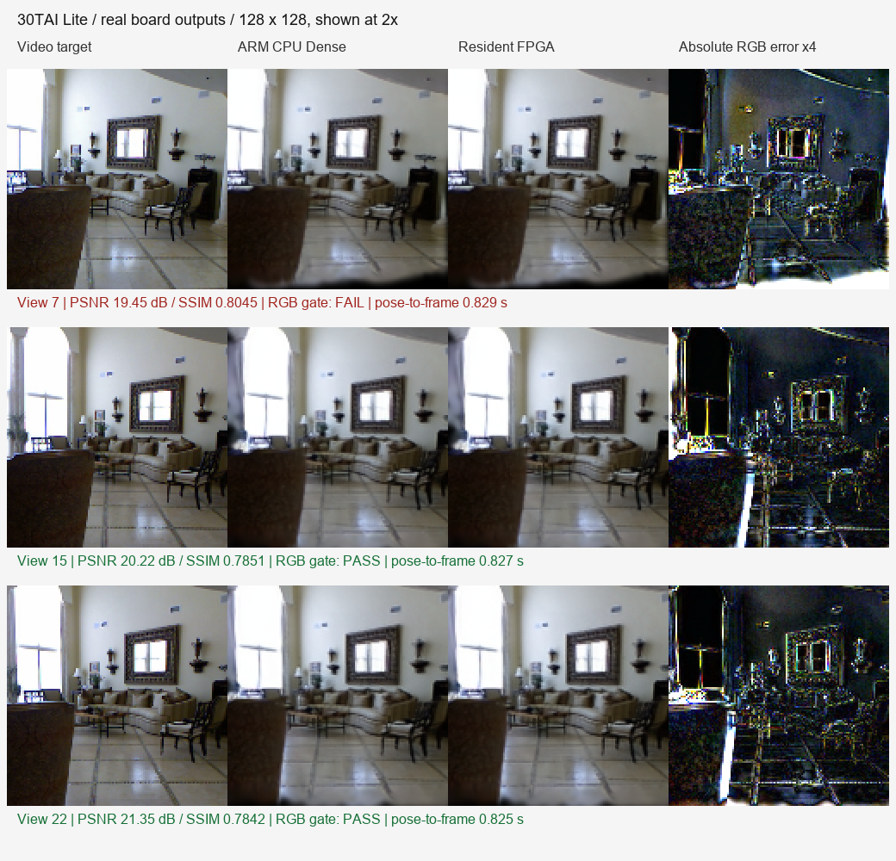

# 30TAI Lite 预热链路与 NPU 实板验证

2026-09-29。用户已恢复实板测试授权。本轮在真实 30TAI Lite 完成 ARM 编译、视频到指定首帧、连续换视角、CPU/FPGA 对照，以及真实 MVSplat NPU 分区检查。**预热 CPU＋FPGA 路径可运行，四线程三次首图平均 27.88 秒；NPU 数值验收失败，尚不能作为正式整链后端。**

原始小结果、逐版本记录和效果图在 [results/20260929/board_warm_npu](results/20260929/board_warm_npu/)，汇总为 [summary.json](results/20260929/board_warm_npu/summary.json)、[versions.csv](results/20260929/board_warm_npu/versions.csv)。大模型、编译图和逐分区输出保留在本地 `../runs/npu_board_v2_20260929`；板端候选为 `/root/fpga43dgs_reconstruction/npu_board_v2_20260929`。冻结渲染包、BOOT 和位流未改。

## 输入与计时合同

- 板端 CPU：4 核 A53，Linux 可见 993 MiB，无 swap；固定 SDK 3.36.1、Torch 2.7.1。
- 同一 3 秒、30 帧视频；上下文帧 0/29，目标视角 7/15/22，128×128，生成 32,768 个高斯。使用官方固定 re10k 权重，不进行逐场景反向训练。
- 视频、位姿、高斯生成、导出和渲染计算全部在板上；电脑仅发命令和取证。本轮输入为已关闭的本地文件，视频采集耗时未测。
- 主计时严格为 `VIDEO_COMPLETE→FRAME_COMPLETE`，终点是预先指定第 7 视角的完整帧和哈希检查。`SCENE_READY` 是中间点。
- 预热在视频前，时间只记录：本轮约 43.69–49.12 秒；包含权重、依赖及渲染设备初始化。不能称开机后 28 秒出图。
- 板卡 RTC 显示 2026-03-13，测试组织日期取电脑 2026-09-29；所有主时延使用同一进程单调时钟。不能按两台机器的墙钟相减。
- 当前只生成两参考视图共同视野的局部模型，不代表整段视频全场景融合或大场景建图。

## 场景准备速度与版本选择

|版本|推理线程/调度|视频结束到首帧 s|网络前向 s|峰值进程树 RSS MiB|
|---|---|---:|---:|---:|
|历史冷路径 threads4_repeat|4，视频后加载权重和独立渲染进程|71.74|13.38|582.05（历史）|
|warm_cpu_serial_v0|2，预热后串行|35.929|21.594|594.42|
|warm_cpu_overlap3_v1|3，重叠；启动环境部分仍为 2 线程|33.380|21.012|600.77|
|warm_cpu_serial4_v2|4，串行|27.213|13.362|588.25|
|warm_cpu_overlap3_v3|3＋准备 1，环境统一为 3|26.975|16.297|619.53|
|warm_cpu_serial4_v4|4，串行|28.350|13.663|573.25|
|warm_cpu_overlap3_v5|3＋准备 1，环境统一为 3|28.243|16.383|617.61|
|warm_cpu_default_v6|更新后的默认入口：4，串行|28.066|13.331|585.05|

四线程串行 3 次：平均 **27.876 s**，中位 **28.066 s**，范围 **27.213–28.350 s**；经验 P95/P99 为 28.321/28.344 s。样本仅 3 个、同一视频，不能声称稳定尾延迟或多场景泛化。历史冷路径到本轮均值的时延下降约 **61.1% / 2.57×**，是相同输入输出合同下的历史对照，包含加载移至视频前的收益，不是同一随机化配对实验，更不是 NPU 加速。

统一环境后的三线程重叠两次平均 27.609 s，仅比四线程串行均值少约 0.268 s，低于当前运行波动。虽然确实重叠了约 3.3 秒 PnP，但三线程网络较四线程慢约 3 秒，收益基本抵消；峰值内存还增加到约 620 MiB。因此当前默认选择**四线程串行**，保留 `--threads 3 --overlap-prepare` 候选和 `--threads 2 --serial-prepare` 回退。`v1` 的环境不一致保留为探索失败，不混入正式重叠均值。

默认最终复跑的辅助阶段如下。子项只在各自边界内解释，不能重复相加：

|阶段|秒|边界|
|---|---:|---|
|解码、两视图几何与目标 PnP|8.849|prepare 内部|
|网络前向|13.331|不含权重加载|
|前向、输入检查、Gaussian 保存等|14.327|包含上行网络前向|
|高斯导出|2.789|导出内部|
|VIDEO_COMPLETE→SCENE_READY|27.178|还包括哈希、接口与装入开销|
|SCENE_READY→首帧完成|0.888|含完整帧和哈希检查|
|主计时|**28.066**|上述最后两项之和|

四线程串行三次高斯、场景列表和首帧哈希均与既有 ARM 冷路径基线一致。三线程输出因浮点归约有小差异；首视角相对四线程图的量化误差另存逐版本 `difference_vs_default.json`，不是将其伪装为逐位相同。

## 常驻渲染与 CPU 对照

同一模型只装入一次，执行 7→15→22→7。四次均与冻结 FPGA 对应视角逐字节一致，返回第 7 视角哈希相同，排除了只回传旧图的情况。

|视角|常驻命令到完整帧 s|冻结 CPU Dense 定时段 ms|冻结 FPGA 定时段 ms|定时段加速|完整独立进程 CPU/FPGA s|
|---|---:|---:|---:|---:|---|
|7|0.829|371.606|271.294|1.370×|3.876 / 3.727|
|15|0.827|371.994|271.570|1.370×|3.876 / 3.725|
|22|0.825|372.006|271.542|1.370×|3.828 / 3.775|
|7 回访|0.827|—|—|—|—|

每目标 CPU/FPGA 对照各一次，仅作功能和性能复核。冻结定时段包含属性、分组排序和渲染子进程；完整独立进程加速仅 **1.014–1.041×**。常驻 0.83 秒包含帧检查、复制和 PPM 输出，不能拿它除以冻结 CPU 的 0.372 秒得出硬件退化或加速结论；二者范围不同。常驻执行中的投影约 178 ms、分组约 33 ms、FPGA 提交/执行/输出等待约 44 ms，其余大量时间仍是 Python 哈希、文件和图像封装。实际显示器刷新/体感输入未测，不宣称交互实时。

## 本轮效果与质量

图中从左到右为原视频目标帧、板端 CPU Dense、常驻 FPGA、绝对 RGB 误差放大 4 倍；原始 128×128 以最近邻放大展示。

|目标|FPGA 对实拍 PSNR dB|SSIM|RGB MAE|像素 MAE P95|最差 16×16 块 MAE|原 RGB 门槛|
|---|---:|---:|---:|---:|---:|---|
|7|19.4519|0.80446|0.06570|0.20485|0.29526|失败|
|15|20.2223|0.78513|0.04668|0.17205|0.23286|通过|
|22|21.3486|0.78423|0.04337|0.14653|0.15168|通过|

预设门槛仍为 PSNR≥20 dB、SSIM≥0.7，未因速度提升而下调。首图右下边界、椅子和窗口等位置有重影/模糊，三视角全通过仍未实现。FPGA 对同一模型 CPU 图为 **52.36–54.77 dB，SSIM 0.99950–0.99962**；CPU 对实拍也仅 19.45–21.35 dB，表明主要缺陷在快速位姿/前馈局部重建链，不能归咎于 FPGA 输出。少量局部 FPGA/CPU 最大绝对差仍有 0.075–0.091，未声称完全相同精度。

LPIPS、实际下游任务精度及全视频覆盖未测。当前输出哈希与已保存参考相同，不将旧独立参考重新记作本轮新测。

## NPU 实板结果：已执行，但未通过

增量诊断更新：在相同真实板卡上复跑 `backbone_cnn`，两次输出一致但仍未过数值门槛；改用 eager 权重加载后，误差与 `precheck()` 的 opid 241 失败均不变。输出 100% 落在 FP16 可表示格点，提示应继续分离精度误差与权重读回问题，不能据此直接放宽门槛。另一个只含一个卷积的真实 `proj_feature` 分区预检也失败于它自己的 opid 22。只编译 backbone 的 `fp32` 对照产物被当前输出布局审计拒绝，未作为可用 NPU 版本。原始数据和下一步最小算子实验见 [NPU 第一步诊断](results/20260929/npu_step1/README.md)；下列整链 CPU+FPGA 指标没有重新测量。

真实 ARM 构建了 `attributes_resident`、`render_resident` 和 ABI 2 `libmgs_npu.so`。38 文件包、编译图、布局、参数及实际动态库预检通过。修复 Windows 编译清单使用反斜杠导致 Linux 查找失败的问题，保留旧清单兼容，同时拒绝越界路径。

NPU 使用真实 ZG330 设备、真实官方网络权重和真实导出 oracle，运行位置检查确认硬件卷积绑定。每个分区单独进程、同输入两次输出可重复，但在原有 `rtol=2e-3, atol=2e-4` 逐元素门槛下全部失败：

|分区|最大绝对误差|RMSE|验收|
|---|---:|---:|---|
|backbone_cnn|0.0400122|0.00519463|失败|
|regressor_residual|0.0116148|0.000397014|失败|
|depth_head|0.229752|0.0610500|失败|
|upsampler|0.0153635|0.00434007|失败|
|proj_feature|0.00235957|0.000171380|失败|
|to_gaussians|0.207672|0.00820922|失败|
|to_disparity|0.0272698|0.00456779|失败|

另有三个保留的诊断结果：

1. 同时加载七个会话后，depth_head 出现非有限输出；单独进程运行则有限且可重复。提示会话/设备状态交互问题，尚未证明具体为哪段内存冲突。
2. 官方 SDK 的诊断 `precheck()` 报告 `The Weight of opid:241 at PLDDR is incorrect`。它是在会话初始化预检中失败，不能据此直接断言七会话覆盖了权重，更不能排除 SDK 预检/上传语义问题。诊断源与日志保留，未将这段不通过的诊断代码塞入生产桥接。
3. FP32 编译的五个厂商阶段执行成功，但输出是当前 ABI 不支持的 Quantized FP32/NCHWc16；独立 SDK 通用执行器进一步执行时输出等待超时。没有绕过布局审计、伪造 FP32 数据或修改包清单。

因此没有完整 NPU Gaussian、NPU 首帧或可信 NPU 加速比。分区运行原始耗时保留在日志中，但**错误输出的短耗时不作为性能成果**。当前还不能把误差全部归因于 TF32 舍入：要先核实权重与各层中间值。

## 2026-09-30 NPU 数值定位与首帧关键路径增量

本轮先用固定输入、单会话、已知权重的一层卷积图做 SDK/桥接基线，再复跑真实
`backbone_cnn` 的多个前缀。已知卷积图的 `precheck()` 和逐元素输出均通过：identity
和 dyadic bit-exact，fractional 的最大绝对误差为 `0.000167668`、RMSE 为
`0.000059451`，通过原有 `rtol=0.002, atol=0.0002` 门槛。板端两次调用的平均成本如下，
计时包括桥接层实际执行的五个阶段：

|已知图|输入写入 ms|提交 ms|等待 ms|输出转换 ms|SDK 总计 ms|
|---|---:|---:|---:|---:|---:|
|identity|0.090|0.417|0.005|0.675|1.188|
|dyadic|0.066|0.373|0.005|0.587|1.030|
|fractional|0.067|0.369|0.006|0.581|1.022|

原始结果见 [`npu_known_conv_detailed`](results/20260930/npu_known_conv_detailed/)。这组
结果只证明通用 NPU 调用、同步和回读接口在单会话下可核验，**不代表真实 MVSplat 的
加速**。真实 backbone 的第一个前缀仍失败（`prefix_00` 最大误差 `0.0924683`，
RMSE `0.00762542`）；因此当前首个偏差发生在真实图的第一段编译/权重/布局边界，
不能把后续七个子图的短耗时用于性能结论。完整前缀记录见
[`npu_backbone_prefix`](results/20260930/npu_backbone_prefix/)。

首帧路径也完成了结构增量：`video_input.prepare` 在两张上下文图准备后只发布第一个
目标位姿；`warm_pipeline` 在推理完成后立即校验该快照并渲染首帧，剩余目标 PnP 在
工作线程继续。首帧导出只写一次已校验的 `model.ply`，后续通过 `export.py
--append-cameras` 向同一 manifest 追加延迟相机，避免再次分解协方差、写入和读回整份
Gaussian。已有完整导出复用测试中，重复导出约 `0.648 s`，仅追加相机约 `0.0187 s`；
这只是主机文件接口测量，尚未替代真实板端 `VIDEO_COMPLETE→FRAME_COMPLETE` 结果。

验证项：`test_initialize` 9/9 通过；Python 语法检查通过；旧导出 ABI 验证通过；板端
已知卷积三图六次调用全部通过。一次完整 CPU 回归成功生成准备输入和导出，但与所选
历史参考输入不一致，故没有把它记作质量/速度成绩。真实 MVSplat NPU 数值门禁仍为
失败状态，生产后端保持 CPU＋FPGA，不加载错误 NPU 输出。

已补 `npu/readiness.py`：在同一真实常驻 worker 上按所有选中分区顺序执行两轮 oracle；哈希、输出和逐元素数值全部通过后，才能加载完整模型并发布公共 READY。实板负向验收确认错误输出被拒绝，`events=[]`，未接收视频，不静默切回 CPU。`oracle_probe.py` 提供不加载整网的低内存诊断入口；失败版本不覆盖。

## 资源、测试和下一步

默认四线程串行最高进程树 RSS **588.25 MiB**，最小可用内存 **263.73 MiB**；最后一次预热结束进程 RSS 及监控原始值都在记录内。进程树 RSS 会重复计算共享页，因此并非精确独占内存。最终复跑全进程 CPU 时间 89.00 秒、外层壁钟 84.38 秒，包含预热与清理，不能直接当作场景阶段 CPU 利用率。

FPGA 资源/时序本轮未重新综合：沿用历史 Slice99.99%、自定义 200 MHz 路径 setup/hold +0.310/+0.054 ns，原厂 AI 脉宽限制仍在；不是新增测量。功耗未测。板卡最后保持在线，无残留测试任务；本轮网络确有一次 Link Down/Up，SSH 断开时编译仍已完成，没有证据认定 OOM。SD 根分区剩余约 1.1 GiB，后续扩大数据前应按已取回证据做受控归档。

本机最终 158 Python 源码语法检查、58 项接口/调度/NPU 测试通过；其中路径、NPU 契约、门控与调度 21 项也在真实 ARM 上通过。三个原生程序已在 ARM 编译并实际执行。板端 oracle、失败门控、常驻换视角及冻结对照分别保留，不能以源码测试代替实板结果。

下一步先独立解决 NPU **权重上传/读回与单层数值**，用一个小分区定位 SDK 行为，再处理多会话状态；通过原数值门槛后再运行完整 Gaussian 和画质对照，最后才讨论它是否减小 28 秒的场景时间。速度链继续保留当前四线程串行，重叠候选不删除。质量侧优先修复快速位姿/相机参数与共同视野边界；后端侧可将完整帧检查和导出改为等价的批量处理，再用当前四视角合同验证收益。

## 2026-09-30 续验：单会话成本、内存交接与首帧

以下是新的板端实测，目标为已有 NYU 片段、两张上下文图、首个新视角第 7 帧、
32768 个 Gaussian 和 128×128 输出。`VIDEO_COMPLETE` 表示视频文件已闭合并交给板端；
`FRAME_COMPLETE` 表示第一张 FPGA 图像已经写完。预热和视频采集不计入场景准备时间。
保留历史四线程串行均值 27.876 s 作为非同配置参考，不据此宣布严格加速比。

|板端运行|视频结束到场景就绪|首帧渲染|视频结束到首帧|进程树 RSS 峰值|可用内存最低|
|---|---:|---:|---:|---:|---:|
|内存 Gaussian 交接 v1|26.252 s|0.681 s|26.933 s|580.48 MiB|203.39 MiB|
|相同配置复测 v2|26.422 s|0.572 s|26.994 s|581.26 MiB|210.93 MiB|

两次均为 CPU MVSplat + 既有 FPGA 渲染，`npu_executed=false`。首图 Gaussian、
常驻输入行、场景和图像哈希均相同。两次均值 26.964 s，仍未达到 20 s 的目标；
相对于旧基线约 0.91 s 的名义差值跨配置、样本数少，不能称稳定收益。
原始记录见 [v1](results/20260930/warm_rows_overlap3_v1/warm_result.json)、
[v2](results/20260930/warm_rows_overlap3_v2/warm_result.json) 和各自的 `measurement.json`。
RSS 是采样的进程树合计，可能重复计算共享页；功耗没有仪器实测。

首帧前只完成第 7 帧的位姿，其余目标位姿在网络前向期间处理。v2 的解码为
3.404 s，上下文 SIFT/匹配/位姿为 1.555/0.396/0.213 s，第 7 帧为
0.703/0.352/0.033 s；剩余两帧位姿合计 2.135 s 与推理重叠。
CPU 前向为 16.580 s，视频准备全量为 9.097 s；这两个阶段有重叠，不能相加
当作端到端用时。首帧直接从已校验的内存 Gaussian 构造 62-float 行，经常驻
`LOADROWS` 装入投影器；PLY/manifest 完整审计延后到首帧之后，并比较参数。
均值、SH 参数位相同；协方差相对最大差 4.78e-7，opacity 最大绝对差
1.229e-8。没有通过省略正确性检查缩短关键路径。

首帧及后续 15、22、返回 7 的常驻视角命令耗时为 0.828/0.824/0.815/0.823 s，
四张图哈希与冻结 FPGA 对照一致，满足当前 <1 s 单帧目标；
[四视角板端记录](results/20260930/rows_multiview_board_v1/validation.json)。
但这不等于高帧率视频渲染，也不含外接控制器与显示链。第 7 帧对真实照片
PSNR 19.4519 dB、SSIM 0.80446，未达到原定 20 dB PSNR；15/22 帧分别
20.2223/21.3486 dB 和 0.78513/0.78423 SSIM。此质量是冻结输出的复核，
不是新画质改善；首帧效果见 [板端图像](results/20260930/warm_rows_overlap3_v1/board/frame_000007_fpga/frame.png)。

七个分区继续采用固定真实输入、每次单会话、连续两次调用，输出有限且重复，
但 **全部未过原逐元素门槛**。第二次调用的诊断时间如下，单位 ms；
`SDK` 包括输入写入、提交、等待和输出 SFB 转换，`等待` 是 worker 往返，
二者不能相加。这里的总计均为错误输出的诊断成本，**不是 NPU 加速成绩**。

|分区|输入打包|SDK|输出解包|完整调用|
|---|---:|---:|---:|---:|
|backbone_cnn|2.208|11.504|6.616|24.313|
|regressor_residual|34.774|12.991|6.353|58.376|
|depth_head|9.117|13.175|6.407|33.287|
|upsampler|26.894|136.618|360.076|559.223|
|proj_feature|637.035|83.528|41.261|778.985|
|to_gaussians|876.953|187.476|148.406|1255.543|
|to_disparity|58.400|17.335|0.623|81.489|

详见 [分区成本原始记录](results/20260930/npu_partition_cost_single_session/summary.json)。
主机打包/解包和 SDK 的 SFB 输出转换是待优化的大项；逻辑边界 79.5 MiB
不能充当 DDR 实测流量。桥接层已把输入写入、提交、等待、转换分开计时，
SDK 会话和输入 Tensor 在单会话内常驻。跨分区设备缓冲直连仍**未实现**，
ICraft 是否有可用设备侧绑定 API 须通过当前 SDK 验证。RKNN 内存绑定和
ONNX Runtime I/O Binding 只能借鉴其缓冲生命周期方法，不能移植其 API
或声称本板零拷贝。

最小已知权重卷积的单会话预检和输出通过，但真实网络第一卷积在相同门槛下
最大绝对误差 0.0924683、RMSE 0.00762542、38.10% 元素越界，
两次结果一致。真实权重单独替换、真实输入单独替换也分别失败。
在 ICraft **量化中间文件** 中按 16 通道块解包后，权重形状为
`[64,3,7,7]`，相对 ONNX 的最大差 0.000383973、RMSE 0.000034997，
与 FP16 舍入结果 99.9681% 逐位相同；见
[可重复权重审计](results/20260930/first_conv_factorial_board/weight_audit.json)。
该结果只排除了这一中间阶段的明显排布错误，不证明最终 ZG 文件上传后的
PLDDR 内容正确。输入、权重、输出简单 FP16/TF32 舍入均不能解释首层
约 0.09 的最大差。SDK 预检在真实卷积报 PLDDR 权重错误，多会话历史上
也出现过非有限输出，所以生产路径仍拒绝 NPU 结果。

追加的精度/布局控制：同一真实首卷积编译为 FP16，实板连续两次均为
最大误差 0.0898752、RMSE 0.00743386，仍未通过；见
[FP16 首层](results/20260930/first_conv_fp16_board/result.json)。全部六种输入通道
排列与 ±2 像素输出平移比较中，TF32 和 FP16 都以原通道顺序、零平移误差最小，
不能靠 RGB/BGR 交换或简单输出错位修复；对照脚本 `npu/first_conv_layout_probe.py`。

FP32 编译产物被生产 host ABI 审计拒绝后，另写了 **隔离诊断**
`npu/fp32_blocked_probe.py`，仅允许无缩放的 FP32/NCHWc16 输出、无通道填充。
已知卷积先行控制中，SDK 权重预检通过，但原始 Tensor 读取和 SDK SFB 导出两种
路径均得到错误的极大数值（最大误差约 1.04556e34）；
[SFB 负向验收](results/20260930/first_conv_fp32_sfb_synthetic_board/result.json)。
因此没有继续把 FP32 真实网络接入主线。直接读取失败也说明不能只凭 JSON 的
逻辑 FP32 类型假定设备原始数据就是普通 float32。该诊断未改变生产 ABI，
不提供可用 FP32 NPU 路径；首次原始读取脚本退出码为零但 `passed=false`，
之后脚本已修正为数值门槛失败返回非零，结果字段为判定依据。

Depth 扩覆盖尝试中，一层相关卷积和细化网络首卷积都能编译、上板执行，
但分别最大误差 0.497955 和 0.009123，均未过门槛；前者完整调用约
7.4 s，不构成收益。卷积-归一化-激活前缀虽可在主机导出，ICraft 生成
的 host 输出布局不满足当前已审计 ABI；完整细化网络编译失败。
因此没有把 depth、注意力或代价体连续迁到 NPU，更未据纯 CPU 重叠实验
推算 NPU+CPU 重叠收益。

ICraft 自身逐层参考也已补齐：固定同一真实输入，运行量化中间图的 HostBackend，
核对导出的输入逐位一致后，与板端结果比较。该参考只用于诊断，**不是 PC 部署成绩**。
TF32 ICraft 参考相对原 FP32 oracle 的 RMSE 为 0.00155963，7.506% 元素超原门槛；
而板端相对该 ICraft 参考仍有最大差 0.09375、RMSE 0.00767243，38.085% 元素越界。
FP16 下板端相对 ICraft 参考最大差同为 0.09375、RMSE 0.00755719。
这说明需区分两件事：量化本身已经不能完全满足当前 FP32 逐元素门槛；真实 NPU
还存在超出该量化参考的偏差。没有通过放宽门槛把后一个问题掩盖。
复现入口 `npu/icraft_first_conv_compare.py`；
[TF32 逐层结果](results/20260930/first_conv_icraft_host_tf32/comparison.json)、
[FP16 逐层结果](results/20260930/first_conv_icraft_host/comparison.json)。

### 渲染封装增量：相机内存接口与等价批量图像转换

`RendererRuntime.render_camera()` 接受 136 字节相机合同，加载场景后换视角不再
重复哈希整份 PLY。相机由管道交给投影进程，通过匿名 memfd 复用冻结相机解码算法；
投影 Attribute 缓冲复用且逐帧清零，避免旧视角残留。排序进程继续常驻。
输出转换改用 NumPy 批量处理，但保留原 Python double 运算和 ties-to-even 取整，
四个浮点字段的有限值检查仍在。`last_rgb` 提供内存 RGB 帧供后续显示接口读取。
场景、属性与 FPGA 帧缓冲之间仍保留 tmpfs 文件接口，不宣称全链零拷贝。

|同一场景的视角序列 7→15→22→7|第 1 次|第 2 次|第 3 次|第 4 次|
|---|---:|---:|---:|---:|
|此前接口，命令到帧 / s|0.8283|0.8244|0.8151|0.8230|
|新接口第一轮 / s|0.1688|0.1726|0.3319|0.1618|
|新接口复测 / s|0.1663|0.1590|0.1560|0.1604|

八次新接口均值 0.18459 s、中位数 0.16403 s、范围 0.15598–0.33192 s。
第一轮第三帧有额外壁钟停顿，保留在统计中；小样本不推断 P95/P99。
对原四次接口均值，观测平均命令延迟减少约 77.6%，约 4.46 倍；这是**完整软件
调用边界的收益**，不是 FPGA 内核算力提高。投影约 43–46 ms、分组约 24–33 ms、
FPGA 提交和渲染约 41–45 ms、结果哈希/拷贝/图像封装约 39–44 ms。
八次浮点帧缓冲和 PPM 均逐字节等于对应冻结 FPGA 输出，返回第 7 视角也完全相同。
[第一轮](results/20260930/frame_multiview_board_v1/validation.json)、
[复测](results/20260930/frame_multiview_board_v2/validation.json)。

完整视频到首帧对照：相同三线程推理/单线程准备配置，新接口两次为
26.16234/26.44714 s，均值 26.30474 s；上一内存行接口两次均值 26.96350 s，
观测减少 0.659 s（2.44%），仍未达 20 s。新候选首帧渲染为 0.18459/0.17616 s，
网络前向为 16.24296/16.30051 s。两次进程树采样 RSS 峰值 574.68/574.05 MiB，
内核单进程 maxrss 分别 580.95/576.46 MiB；最低可用内存 206.98/207.26 MiB。
预热 49.53/45.99 s，仅记录，不纳入性能考核。
[整链第一轮](results/20260930/warm_frame_overlap3_v1/warm_result.json)、
[整链复测](results/20260930/warm_frame_overlap3_v2/warm_result.json)。
网络仍为 CPU，NPU 仍未通过；Gaussian/场景/图像哈希保持不变，质量没有改善。

### 归档延后候选的验收与限制

此前内存交接仍在 `ModelRuntime.infer()` 内先写并重读 NPZ。本轮最后一个增量将
NPZ 归档暂存在内存并保留其原字节哈希，首帧使用已验证参数；`FRAME_COMPLETE`
之后再写盘、读回、逐字段比较，并将 `archive_verified` 置为 true。
所有检查完成后整次测试才通过。串行/冷路径仍保留原归档方式。

两次新候选为 **26.97984 / 26.70711 s，均值 26.84347 s**；首帧渲染
0.19565/0.18430 s，网络前向 16.76940/16.65550 s。归档审计的约 0.294 s
已移到首帧之后，但本次样本没有显示比上一候选 26.30474 s 均值更快，不能把
“少写一次文件”直接等同于提速。保留两个候选供后续受控对照。
高斯行转换实测 **2.5600/2.5385 s**，是网络以外值得继续优化的项。
进程树采样 RSS 峰值 564.77/569.73 MiB，最低可用内存 209.47/204.91 MiB；
内核 maxrss 570.56/571.63 MiB。样本与缓存状态不足以证明归档方式降低了内存。
[第一轮](results/20260930/warm_archive_overlap3_v1/warm_result.json)、
[复测](results/20260930/warm_archive_overlap3_v2/warm_result.json)。

最终 27 项接口/调度/NPU/归档/帧格式测试通过，68 个主线 Python 源码语法通过；
ARM 投影与排序程序实际编译，两个完整渲染接口候选各完成两轮视频到首帧验收。
新图像、Gaussian、场景及相机哈希保持冻结基准；没有重新训练、改 NPU 门槛或
改 FPGA 内核。FPGA 资源和时序未重测，功耗未测。
三阶段板端源码已取回 [源码快照与哈希](results/20260930/source_snapshots/manifest.json)，
分别对应 `rows`、`frame` 和 `archive`，便于回退及后续比较。

收尾检查根分区只余 92 MiB；停止测试后，将四个本轮生成的中间诊断目录流式
备份到本机 `runs/board_archives/diagnostics_20260930.tar.gz`，18165 个普通文件的
SHA-256 在传输前、本地归档内和删除前逐一核对一致，才清理板端副本。
[归档凭据](results/20260930/board_archive_receipt.json) 保存原路径与逐文件哈希。
板端根分区恢复约 588 MiB 可用，常驻候选、SDK/运行环境和冻结包保留；测试
结束时无残留推理或渲染进程。归档在性能测试之后进行，不计入性能数据。

缓冲生命周期设计的参考为 [RKNN 内存绑定示例](https://github.com/rockchip-linux/rknpu2/blob/master/examples/rknn_api_demo/src/rknn_create_mem_demo.cpp)
和 [ONNX Runtime I/O Binding](https://onnxruntime.ai/docs/performance/tune-performance/iobinding.html)。
它们用于理解预分配、所有权和复用；ICraft 接口、布局和缓存一致性仍须独立验证，
本轮没有把其他平台的 API 或性能数字当作本板能力。

下一道验收先查最终 ZG 权重打包/上传和首卷积实际算术，再要求七分区
逐元素、有限值、多会话及完整 Gaussian/图像门禁通过。之后才可对同一视频
比较完整前向和 `VIDEO_COMPLETE→FRAME_COMPLETE`，并评估相邻图融合、
设备缓冲复用以及剩余 PnP 与 NPU 前向的真实重叠。
