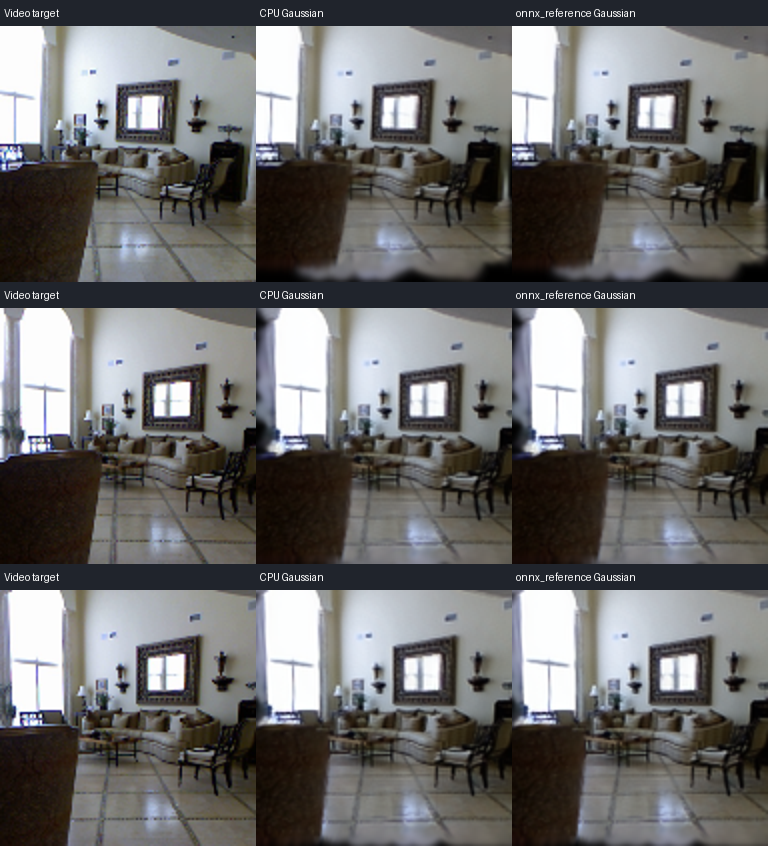

# NPU 部署 v2：缓冲复用、完整性预检与分区验收

2026-09-29。本轮在电脑完成代码、真实输入回归和 SDK 头文件编译检查，没有连接板卡。NPU 仍是待实机验收的 MVSplat 子图候选；不能据此宣布 NPU 加速或视频到首帧提速。原冷路径与冻结 FPGA 渲染包保留。

## 已完成的部署改动

1. 顺序分区共享一个输入区、一个输出区。每次调用持有锁，输出复制为独立 Tensor 后才允许复用。最大输入 20.375 MiB、最大输出 16 MiB，总容量 36.375 MiB。旧 `per_partition` 模式保留用于同代码对照；没有新增双缓冲或异步调度。
2. NCHW→NHWC 直接复制进 IPC 映射，不再先分配连续浮点临时数组。全分区每轮减少 45.75 MiB 的此类临时数组写入，单次最大数组 20.375 MiB；这是代码的数据量核算，不是总线或峰值 RSS 实测。逻辑 I/O 仍为 79.5 MiB，输出 SFB 转换与 SDK 拷贝仍在。
3. 协议和桥接 ABI 升至 2，READY 校验版本及缓冲描述；原生 forward 检查输入/输出字节长度。旧库、错误命令、乱序请求、缓冲文件尺寸变化和超预算均失败退出，无静默 CPU 回退。ARM 库必须重新构建。
4. 包内增加部署合同。修复按子集重新打包后源清单哈希不匹配的问题，另保留原始来源哈希。新增 `preflight` 校验全部文件、权重/图/oracle 关联和 IPC 容量；ARM 依赖检查只加载库，不初始化 NPU 设备。
5. 新增 `benchmark`，同一真实张量对 CPU 和候选交替顺序测速，保存所有样本与逐次正确性；报告平均、中位、范围、P95/P99 和打包、IPC 等待、SDK 写入/计算等待/SFB 转换、解包耗时。不能把这些子模块时间之和当成完整场景耗时。

默认 `shared` 已接入 `initialize`，会话与缓冲在 READY 前建立。视频后的场景准备主计时仍是 VIDEO_COMPLETE→首张指定视角 FRAME_COMPLETE。预热和输入时间只记录。未选择的网络层以及位姿、注意力、代价体重采样、两个细化 UNet、高斯变换仍在 CPU，已有渲染由 CPU+FPGA 完成。

## 验证条件与原始证据

官方完整 re10k 权重，固定两视图 128×128；同一 3 秒视频的上下文帧 0/29、目标帧 7/15/22，32,768 Gaussian。上下文 SHA256 为 `e81a9a7b53e015bb6cf0f4123a7b6becf33a858f4fd28c58ef07c1e197f50823`。Torch/ONNX 均用电脑 CPU，两线程；ICraft 编译图 TF32 未在本轮硬件执行。

结果快照见 [results/20260929/npu_deployment_v2](results/20260929/npu_deployment_v2)。较大的模型、编译图、输入与运行目录在 `../runs/npu_deploy_v2_*`，不纳入 Git；每个版本独立保存。

|检查|结果|能说明什么|
|---|---|---|
|Python 源码/契约|154 文件语法检查，55 项测试通过|软件接口、状态及失败行为通过|
|原生桥接|ICraft 3.36.1 真实头文件 MSVC 语法检查通过|不是 ARM 链接或 SDK 执行|
|实际编译图|7 个已编译图重新审计通过，25 Conv、127 HardOp|复核已有编译产物，本轮未重新编译图|
|新旧缓冲整网|各 7 oracle + 2 次完整前向，均通过|输出复用无串写；两种模式及历史 ONNX 输出哈希相同|
|真实 NHWC 布局|7 分区，每种路径 1 次预热 + 20 次测量，294 次精确往返|实际编译 ABI 对应布局正确，电脑内存路径可用|
|分区测速|每分区 1 次预热 + 20 次 CPU/ONNX 配对，所有输出通过|测速入口可用，不能选择板端 NPU 最优组合|
|完整/单分区部署包|38 / 14 个文件逐项校验；单分区包解压换路径后再次通过|可迁移、可拆分，外部 SDK/权重/代码仍需配套|
|预检异常|改坏权重、增加未登记文件、容量超限、旧 ABI 合同，4/4 拒绝|不会将已发现的坏包标记就绪|

所有模式的 Gaussian SHA256 都是 `45fc3a3dcfc549e5fd9cae3401b053c7f8c8bf520b01b9e7336778ea21672e5c`。共享缓冲版相对 Torch 的最大绝对误差：位置 0.0024643、协方差 0.00018787、SH 7.63e-6、透明度 3.64e-6；按既定逐元素相对/绝对误差门槛通过，位置单位不是米或毫米。

## 本机容量与拷贝结果

|指标|原方式|v2|解释|
|---|---:|---:|---|
|全 7 分区 IPC 文件容量|79.5 MiB|36.375 MiB|减少 43.125 MiB / 54.25%，不是整机 RSS 降幅|
|单轮逻辑输入+输出|79.5 MiB|79.5 MiB|这次没有改变子图边界|
|布局转换额外连续浮点数组|每轮累计 45.75 MiB|0|仍有目的缓冲、有限值检查与输出 Tensor|
|真实 DMA/DDR 字节、NPU 总时间|未测|未测|等待实板|

下面只计电脑上的输入布局转换，旧路径为先连续化再复制，新路径为直接布局拷贝；正确性检查在计时区间外。各 20 个样本，保留全部原始值。P95/P99 为经验分位数，不代表视频工作负载尾延迟。

|分区|旧中位 ms|新中位 ms|下降|
|---|---:|---:|---:|
|backbone_cnn|0.1941|0.1170|39.7%|
|regressor_residual|0.7558|0.4371|42.2%|
|depth_head|0.3244|0.1616|50.2%|
|upsampler|0.7989|0.5016|37.2%|
|proj_feature|20.3883|16.4885|19.1%|
|to_gaussians|26.2115|21.9029|16.4%|
|to_disparity|1.5950|0.8982|43.7%|

另一个测试比较的是本机 Torch 子模块与 ONNX CPU 常驻进程，后者包含 IPC 和布局处理。这个对照不是 NPU：

|分区|Torch 中位 ms|ONNX 工作进程中位 ms|
|---|---:|---:|
|backbone_cnn|36.825|27.177|
|regressor_residual|1.278|1.989|
|depth_head|11.250|11.042|
|upsampler|14.677|16.413|
|proj_feature|10.473|16.606|
|to_gaussians|114.782|121.249|
|to_disparity|9.552|10.753|

若干小分区在这一电脑对照里更慢，说明不能只凭“可编译”就默认全部下放有收益；这也不代表它们在 ZG330 上一定更慢。回板后使用同一入口测真实 NPU，再通过完整链路决定组合。

## 效果图与质量

左列真实目标帧，中列 Torch Gaussian，右列新共享缓冲 ONNX Gaussian，两者均通过同一个独立 NumPy SH3 渲染器输出。它不是 NPU 或 FPGA 生成的本轮新图。

|目标帧|相对实拍 PSNR / SSIM|相对 Torch 图 PSNR|最差 16×16 RGB MAE|
|---|---|---:|---:|
|7|20.1956 dB / 0.805359|104.73 dB|0.287805|
|15|20.2332 dB / 0.836486|105.19 dB|0.220125|
|22|24.1844 dB / 0.846565|113.40 dB|0.112480|

三视角通过原 20 dB/0.7 门槛；与上一版本电脑图一致。首两张余量小，图中模糊、边界空洞仍明显，未解决重建本身质量问题。只覆盖两上下文帧共同视野，不是全视频建图。LPIPS 与下游任务质量未测。不能把电脑的位姿与渲染质量替代 ARM 结果。

## 板端全链指标：历史基线，本轮未重测

|指标|已有结果/本轮状态|
|---|---|
|VIDEO_COMPLETE→首帧验证完成|历史四线程 71.74 s、两线程 74.04 s，样本少；新共享缓冲/NPU 版本未测|
|准备 / 推理 / 导出|历史约 8.58 / 30.80 / 5.36 s，推理含加载，其中网络前向 13.38 s|
|首次渲染|历史外层约 9.24 s；内部约 805.64 ms，不能当成稳态|
|稳态 CPU / FPGA 定时段|历史约 372.5 / 272.2 ms，约 1.37x；完整外层约 3.87 / 3.77 s，约 1.03x|
|实拍 PSNR / SSIM|历史 19.45/20.22/21.35 dB，0.8045/0.7851/0.7842；第 7 帧仍未过门槛|
|进程树 RSS / 最低可用内存|历史 582.05 / 266 MiB；新 NPU 会话、IPC 与渲染并存未测|
|FPGA 资源和时序|冻结历史 Slice 99.99%、200 MHz，自定义 setup/hold +0.310/+0.054 ns；原厂 AI 脉宽问题仍有记录；本轮未生成新位流|
|LUT/FF/DSP/BRAM 新变化|本轮无硬件实现报告，未新增测量|
|实测功耗、能量、板端 P95/P99|未测|

进程树 RSS 会重复计算两个进程映射的相同页面；650 MiB 监控是保守限制，不代表物理页去重后的用量。共享文件容量不能预测 SDK 会话占用，更不能单凭本轮节省值推断板卡剩余内存。

## 优劣与下一步

这次降低了部署接口的已知容量和输入复制开销，支持旧模式对照、子集打包及错误拒绝；网络算法和权重没有变化，离线数值也未退化。局限在于逻辑 I/O 仍大、SDK 的 SFB 输出转换仍在，CPU 侧还承担注意力、代价体与细化网络，7 个子图全开是否划算依然未知。

回板后先检查此前中断任务和设备状态，构建 ABI 2 ARM 桥接库；从 backbone_cnn 单分区开始做固定上下文数值验证与带内存监控的同板配对测速，再逐项选择组合并跑完整视频到首帧。backbone 有 16 个卷积而逻辑边界只有 1.375 MiB，是优先验证对象，但尚未证明有加速。分区通过后才验收 NPU 与既有 FPGA 渲染共存、真实画质及场景准备时间。

构建、预检、测速和整链参数见 [npu/README.md](npu/README.md)。完整包与单分区包信息见结果目录中的 `package.json` / `subset_package.json`；它们仅是编译图/输入候选包，必须搭配运行时代码、官方固定权重及 ARM SDK，不能单独启动整个工程。
