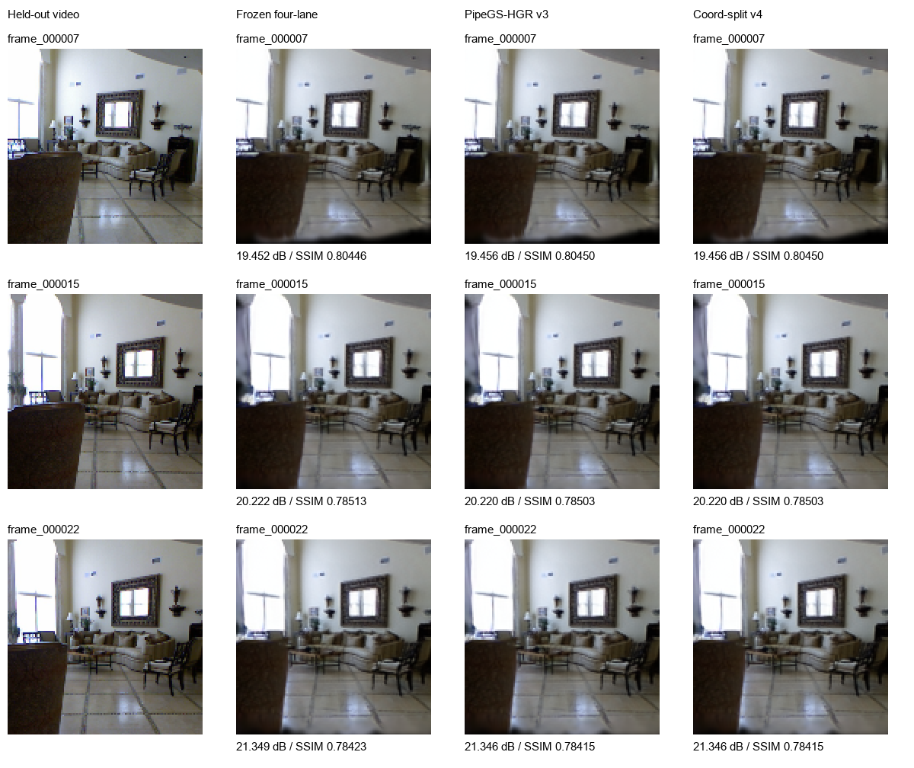

# 版本选择与实板结果

封装日期：2026-10-09；以下性能、画质来自 **2026-10-08 的既有实板测量**，
本次没有重新烧录或测速。完整数据位于 `board_20261008/`。

范围：32768 高斯、SH3、128×128、相机 7/15/22；场景已加载，
从相机请求到完整 RGB 返回，不包括归档、网络显示、视频重建和场景加载。
A-B-B-A 四阶段各 30 帧，两种固件各 60 帧，未剔除慢样本。

| 指标 | 旧版四路主线 | 新版两路 HGR v4 |
|---|---:|---:|
| 平均换视角 | 43.575 ms | 53.302 ms |
| 中位数 | 42.183 ms | 53.610 ms |
| P95 / P99 | 52.893 / 62.080 ms | 54.587 / 54.658 ms |
| 最小 / 最大 | 40.219 / 69.943 ms | 51.637 / 54.716 ms |
| FPGA 服务（含调用） | 24.417 ms | 34.900 ms |
| 等待 | 12.899 ms | 23.426 ms |
| 硬件任务周期 | 4,762,963 | 6,859,111 |
| 进程峰值 RSS | 39,572 KiB | 39,608 KiB |
| 逻辑输入 / 输出 | 3,352,725 / 262,144 B | 相同 |

新版整帧慢 22.32%，主要增加在 FPGA 服务/等待。旧版作为默认，新版保留为
研究分支。逻辑字节不是实测 DDR 总流量；功耗/能量未测。

| 留出视角 | 旧版 PSNR / SSIM | 新版 PSNR / SSIM |
|---|---:|---:|
| 7 | 19.4519 dB / 0.804464 | 19.4556 dB / 0.804498 |
| 15 | 20.2223 dB / 0.785135 | 20.2198 dB / 0.785032 |
| 22 | 21.3486 dB / 0.784232 | 21.3460 dB / 0.784151 |

按 clipped float RGB 和 11×11 Gaussian SSIM 比较，平均 PSNR 变化
-0.00046 dB，SSIM 变化 -0.000051；通过项目小幅画质变化门槛。
原重建模糊仍在；连续路径闪烁、LPIPS 没有测量。

## 资源口径纠正

**本表用参与实板比较的旧版 grouped-shared 与新版两路的最终 Routed 报告**，
并非此前 `v4_matched_r9` 的放置阶段比较：

| 全板资源 | 旧版四路主线 | 新版两路 HGR v4 |
|---|---:|---:|
| LUT / 78600 | 61260（77.94%） | 58083（73.90%） |
| FF / 157200 | 98377（62.58%） | 88732（56.45%） |
| BRAM36 等效 / 265 | 218.5（82.45%） | 201（75.85%） |
| DSP / 400 | 252（63.00%） | 128（32.00%） |

两路放置阶段 Slice=19516/19650（99.32%）；上面的 Routed 层次报告
不含 Slice 计数，因此不混报为布线后统计。
旧报告中 LUT=57971、FF=88719 是两路放置阶段数据；对照的 62942/98329/204
属于四路 HGR r9，不是本次四路 grouped-shared 主线。历史报告保留原文，
引用当前版本资源以本页及对应 `hardware/reports/utilization.rpt` 为准。

新版布线后 setup WNS=+0.030 ns、TNS=0，hold WHS=+0.029 ns、THS=0，
unrouted=0。保留原厂 AI 脉宽 WPWS=-0.409 ns、TPWS=-0.479 ns、2 个端点；
不能宣称全板无条件时序签核。HLS、放置、最终布线、实板结果分别保存。

旧四路 BOOT 已在 10 月 8 日实验结束后恢复并核验；本次封装没有更改板卡状态。
