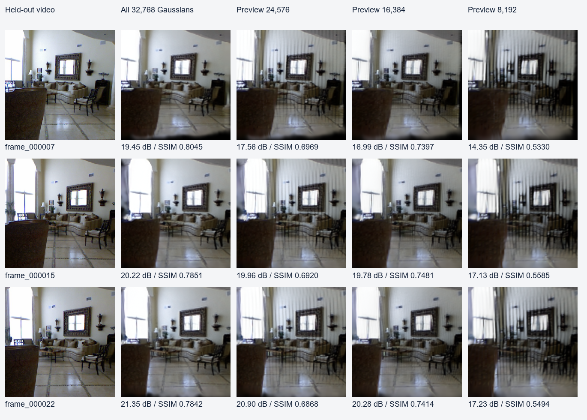

# 原生渲染与速度优先预览：2026-09-30 实板结果

## 结论与计时边界

本轮在同一 30TAI Lite 上完成编译、真实 FPGA 渲染、CPU 对照和视频整链接回。
128×128、32,768 个高斯、固定三个留出视角。旧接口本轮 18 次平均 **157.504 ms**；
新完整点集平均 **50.645 ms**，约 **3.110 倍**。
16k 预览为 **31.932 ms**，约 **4.933 倍**，代价是近似和质量下降。

旧接口返回前包含归档；新交互接口的终点是 **完整 RGB 帧已收到并完成结构检查**，归档由调用方随后显式执行。
因此三倍是系统交付路径改善，不是 FPGA 内核吞吐凭空提高三倍。视频首帧适配器仍包含原文件/哈希终点。
预热、场景装入、遥控器传输和屏幕显示均不计入换视角时间。FPS 为顺序调用平均时延的倒数，未测试物理显示刷新。

| 路径 | 保留高斯 | 平均 ms | P95 ms | 折算 FPS | 对实拍 PSNR dB | 对实拍 SSIM |
|---|---:|---:|---:|---:|---:|---:|
| batch2 | 32,768 | 50.645 | 51.789 | 19.75 | 19.45–21.35 | 0.7842–0.8045 |
| preview24k | 24,576 | 41.564 | 42.164 | 24.06 | 17.56–20.90 | 0.6868–0.6969 |
| preview16k | 16,384 | 31.932 | 32.496 | 31.32 | 16.99–20.28 | 0.7397–0.7481 |
| preview8k | 8,192 | 22.763 | 23.250 | 43.93 | 14.35–17.23 | 0.5330–0.5585 |

每行 18 次换视角（三个视角各六次），第一次调用另存。全部计时帧事后与对应审计帧比较通过。
完整点集的三个原始帧和 PPM 哈希等于冻结 FPGA 后端。非同一视频/场景的泛化尚未测试。
完整点集首视角 PSNR 19.4519 dB，低于历史 20 dB 门槛；用户本轮允许速度优先近似，不改写历史门槛为已通过。

## 实际改动与分离实验

1. 三个常驻子进程重构为一个原生进程，投影、排序、SDK 提交在内存对象之间交接，不生成中间属性/场景文件。
2. 世界协方差和激活透明度在 LOAD/LOADROWS 时生成；相机投影、深度、屏幕 conic 和方向相关 SH 每帧更新。
3. 投影使用四核；正深度按 FP32 位序做四趟稳定基数排序，深度相同仍保持原始 ID 顺序。桶改为连续列表，工作区复用。
4. SDK 设备、设备内存、命令/结果数组常驻；原硬件两槽队列保持。测得小批次 2 优于 16/32，不能假设批越大越快。
5. 原生 C++ 完成 RGB 转换，Python 只接收紧凑帧；诊断浮点帧可显式请求。不是零拷贝：管道、SDK 上传与回读仍存在。
6. 两类近似都保留：按重要性直接裁剪；均匀抽样并按原数量/保留数量放大世界协方差。后者补偿覆盖，仍可能条纹/模糊。

| 分离配置 | 平均 ms | 解释 |
|---|---:|---|
| 旧三进程完整调用 | 157.504 | 包含归档 |
| 合并原生路径、未缓存、单核 | 84.118 | 完整 RGB 返回 |
| 缓存固定属性、单核 | 73.628 | 固定运算移出逐帧路径 |
| 缓存、四核、比较排序 | 52.522 | 真正执行多核投影 |
| 四核、基数排序、批 8 | 51.606 | 基数排序仅省约 1 ms，收益有限 |
| 四核、基数排序、批 2 | 50.645 | 默认完整点集候选 |
| 直接按重要性裁到一半 | 29.543 | PSNR 对实拍仅 12.79–14.19 dB，明显黑洞，负结果保留 |
| 均匀覆盖补偿、保留一半 | 31.932 | 对实拍 16.99–20.28 dB、SSIM 0.740–0.748 |

同接口四核 CPU Dense：**178.948 ms**，新完整点集 CPU＋FPGA 约 **3.533 倍**。
CPU FP32 与现有 FPGA 数值精度不同，二者图像相对 PSNR 51.11–52.96 dB；不是逐位相同算术的纯硬件频率对照。
完整点集当前投影 7.63 ms、分组排序 12.31 ms、FPGA 准备/提交/执行/回读 28.43 ms、RGB 转换 1.28 ms。
上传/等待/回读是执行段的子项，不能与执行段重复相加。输入/输出字节是 SDK payload，不是实测 DDR 流量。

## 视频结束到首帧

同一现有视频、CPU MVSplat 三线程与准备重叠、相同当前 Python 代码，切换渲染后端。

| 运行 | VIDEO_COMPLETE→FRAME_COMPLETE | SCENE_READY→FRAME_COMPLETE | 预热，仅记录 | 进程树峰值 RSS |
|---|---:|---:|---:|---:|
| live_full_pipeline | 24.000191 s | 81.79 ms | 47.27 s | 614.17 MiB |
| live_matched_baseline | 24.735311 s | 173.94 ms | 45.30 s | 603.75 MiB |
| live_full_repeat | 24.656152 s | 80.05 ms | 44.48 s | 611.67 MiB |

原生两次平均 **24.328171 s**，仍未达到 20 秒目标。
旧后端同代码对照只有一次，不能据此宣称稳定的整链加速百分比。与较早 26–28 秒记录也不做纯渲染归因：
本次使用此前已提交的导出优化，准备/推理本身有波动。三次首帧原始哈希全部相同。
新后端最低系统可用内存约 **236.43 MiB**；
原生渲染单进程最高 rusage RSS 约 38.39 MiB，与包含模型的整链进程树 RSS 不同口径。
位流/BOOT 没改，LUT/FF/BRAM/DSP/时序未重新综合；功耗未测。NPU 本轮未参与，数值问题没有被跳过。

## 验证及复现

- 真实 ARM 编译三轮成功。SDK 头文件既有警告保留在本地 build.log。
- 71 项离线接口/生命周期/NPU 合同回归通过；305 个 Python 文件语法检查通过。
- 实板验证 LOADROWS、换场景再恢复、64×64/129×65/128×128 切换和首帧适配器；缓存/未缓存对应输出一致。
- v2 验证脚本曾漏上传 initialize/renderer_runtime.py，未算通过；v3 补齐后通过，未修改冻结包。
- v1/v2/v3 原始数组、负结果、源码摘要分别保存，未覆盖历史计时。图像质量另存 quality.json，含局部误差。
- 完整流程使用 initialize 的 --live-renderer 参数；交互使用 rendering.runtime.LiveRenderer。
  快速预览显式设置 max_gaussians=16384、uniform_preview=True；默认不丢点。

板端壁钟与主机日期不同（SDK 日志为 2026-03-13）；本报告日期使用主机 2026-09-30，所有耗时使用同一进程 monotonic 差值。

原始记录位于 ../results/20260930/live_v1、live_v2、live_v3、live_full_pipeline、live_matched_baseline、live_full_repeat。
下一步更有价值的是改善稀疏预览的空间抽样/合并以抑制条纹，以及分析排序和 FPGA 执行剩余开销。
场景准备若要低于 20 秒，仍须针对 MVSplat 前向和位姿准备单独优化，不能靠更改渲染计时口径解决。
